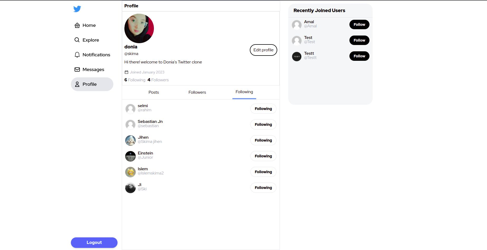
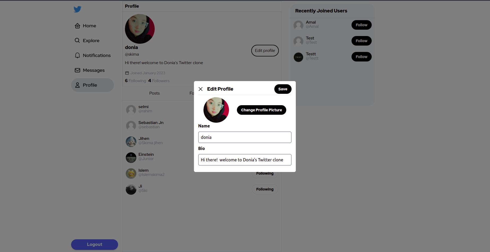
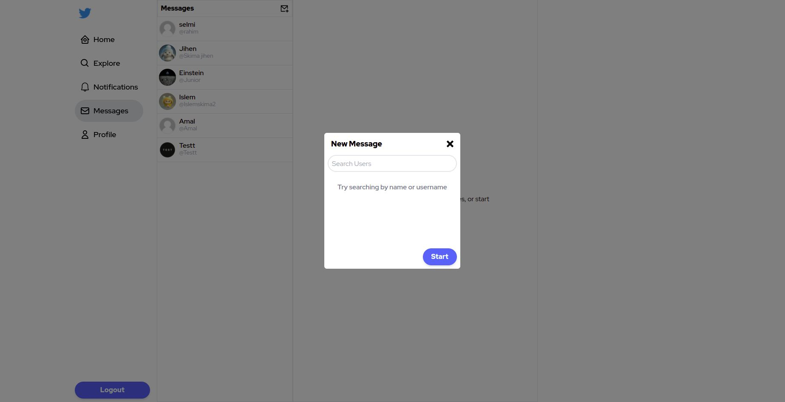
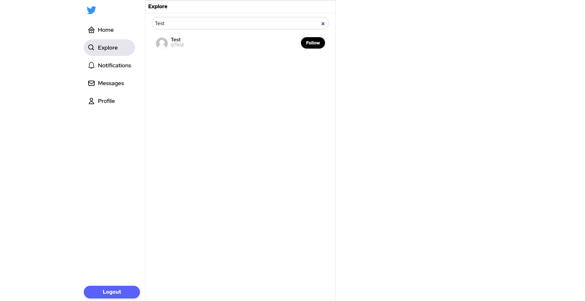
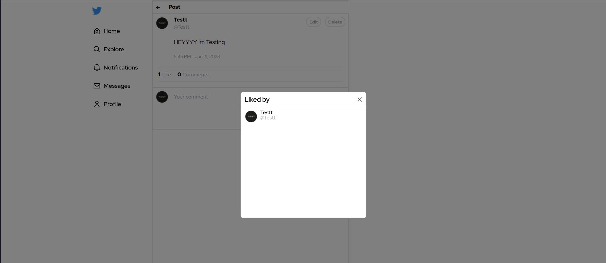
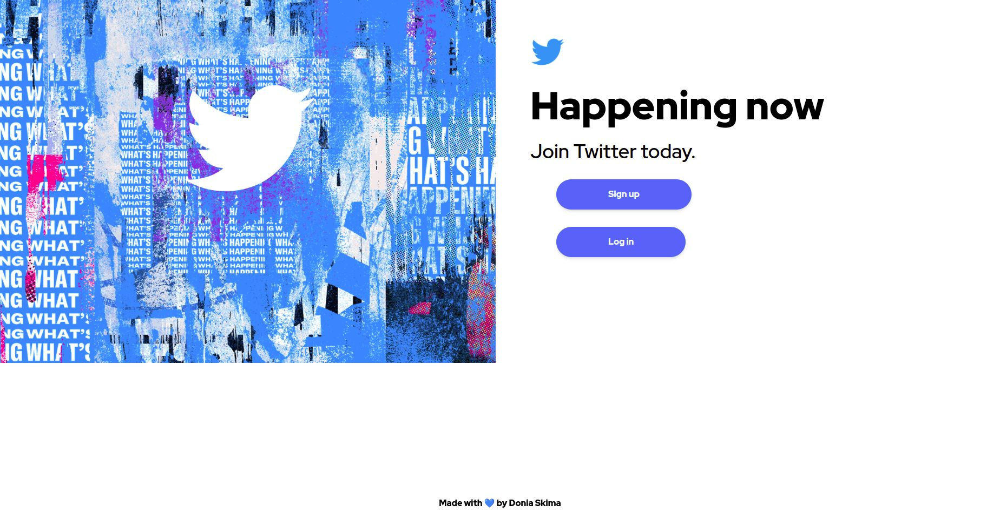
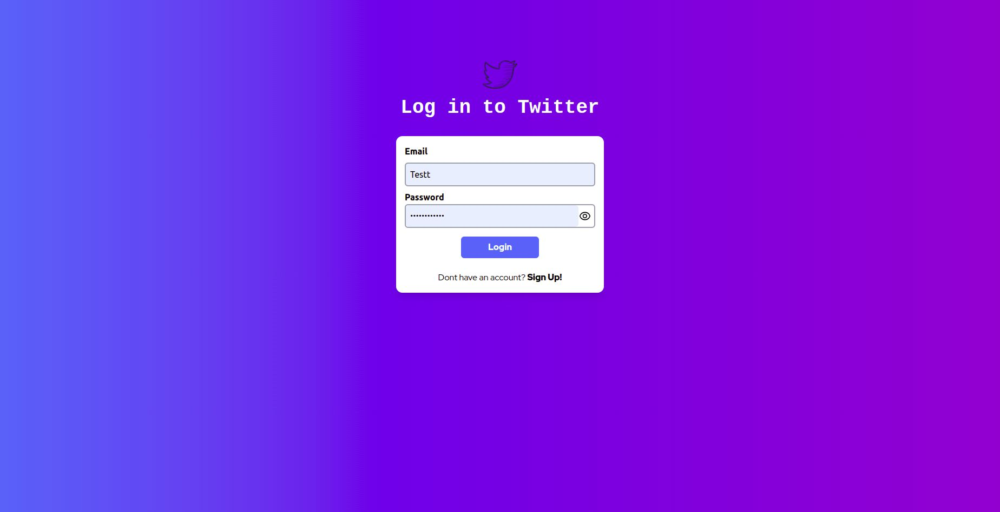
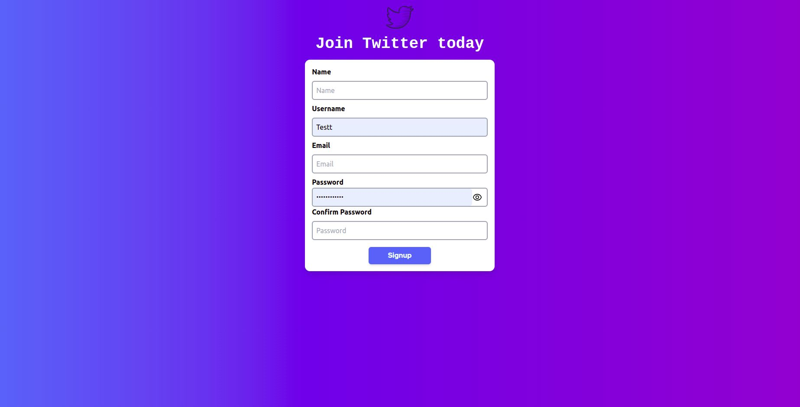
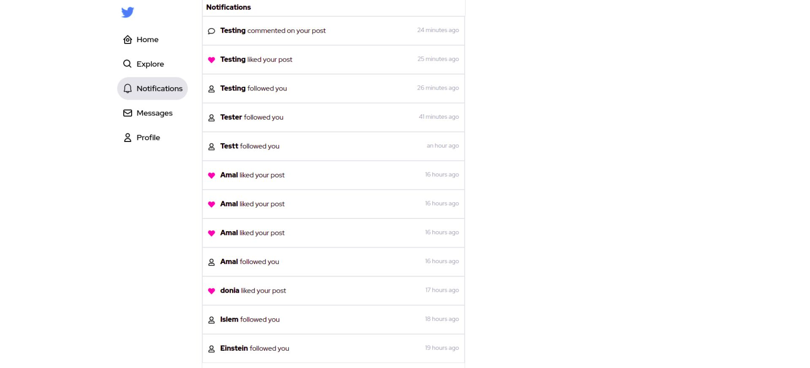

# Twitter clone

Twitter clone web app built using MERN stack.

## Screenshots

| Screenshot 1 | Screenshot 2 | Screenshot 3 | Screenshot 4 | Screenshot 5 | Screenshot 6 | Screenshot 7 | Screenshot 8 | Screenshot 9 | Screenshot 10 | Screenshot 11 |
|:-------------:|:-------------:|:-------------:|:-------------:|:-------------:|:-------------:|:-------------:|:-------------:|:-------------:|:--------------:|:--------------:|
|  |  |  |  |  |  |  |  |  |  |  |
| *Caption 1* | *Caption 2* | *Caption 3* | *Caption 4* | *Caption 5* | *Caption 6* | *Caption 7* | *Caption 8* | *Caption 9* | *Caption 10* | *Caption 11* |

## Technology Stack

-React - Redux-Toolkit

-Styling using TailwindCSS

-React Router for routing v6.7.0

-Cloudinary for image upload

-Express & Node for API Repo

-Socket.io as websocket for instant messaging

-MongoDB using mongoose for data storage

-User authentication using JWT

### Functionalities

-Follow/Unfollow individual user.

-View and update details such as - profile picture, name, bio.

-Compose posts.

-Delete posts or comments created by logged in user.

-Like posts.

-List of users who have liked a post.

-Search for users

-Notifications

-View user feeds.

-Instant encrypted messaging.

-View previously sent messages with timestamps.

-delete messages and chats.
